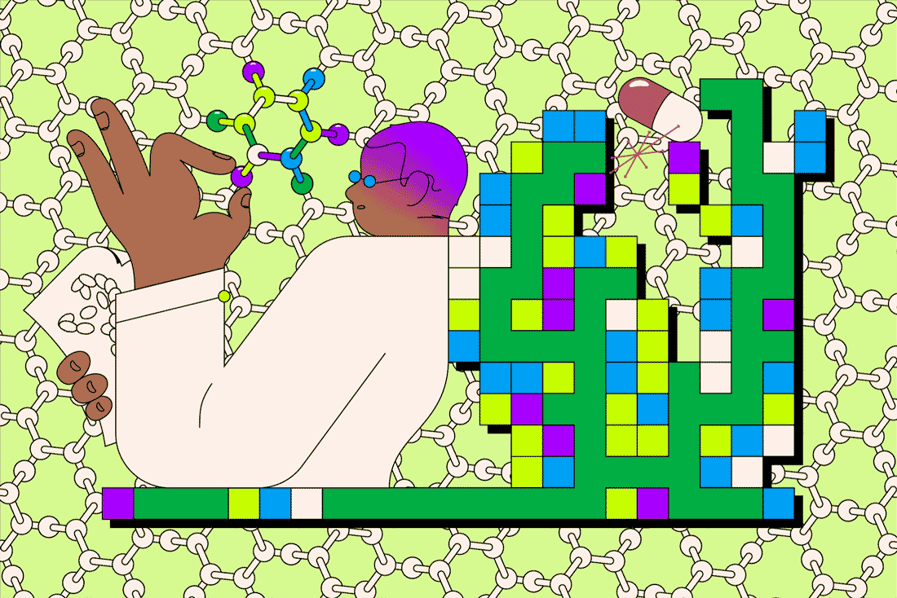

<div align="center">

# Hi, I'm Piyush Meshram

### Computational Biologist • Bioinformatician • Structural Biology • Data Science

<p>
Building reproducible computational pipelines for genomics, metagenomics, protein engineering and AI-driven biological data analysis.
</p>

---

<!-- ====================================================== -->
<!--                 HERO GIF (Replace Later)                -->
<!-- ====================================================== -->



<!-- Example -->
<!-- https://raw.githubusercontent.com/PiyushMe4/repository-name/main/assets/hemoglobin.gif -->

---

<p>

<a href="https://github.com/PiyushMe4">

</a>

<a href="https://github.com/PiyushMe4?tab=repositories">

</a>

<a href="https://www.linkedin.com/in/piyushmeshram-b300b522a/">

</a>

</p>

</div>

---

# About Me

- M.Sc. Bioinformatics
- Research Intern — GeNext Genomics Pvt. Ltd., Nagpur
- Computational Biology & Structural Bioinformatics
- Protein Engineering & Antibody Design
- Metagenomics & AMR Surveillance
- Data Analytics & Machine Learning
- Scientific Workflow Development

---

# Research Interests

```text
Structural Bioinformatics
Protein Engineering
Antibody Design
Computational Biology
Genomics
Metagenomics
Machine Learning for Biology
NGS Analysis
One Health
Drug Discovery
```

---

# Tech Stack

### Languages


### Bioinformatics

FastQC • MultiQC • fastp • Bowtie2 • DIAMOND • CARD • PyMOL • PatchDock • HawkDock • PRODIGY • ClusPro • AlphaFold • ChimeraX

### Data Science

Pandas • NumPy • Matplotlib • Plotly • Scikit-Learn • Jupyter Notebook

### Version Control

Git • GitHub

---

# Featured Project

## Computational Metagenomics Analysis of One Health-Oriented Antimicrobial Resistance Dynamics of Wastewater Across Five Major Cities

Publication-quality Master's Dissertation repository featuring:

- Comparative wastewater metagenomics
- DIAMOND-based ARG profiling
- One Health framework
- Publication-quality visualizations
- Reproducible computational workflow

Repository:

**https://github.com/PiyushMe4/Indian-Urban-Resistome-Comparitive-Analysis**

---

# GitHub Analytics

<p align="center">


</p>

---

# Contribution Graph

<p align="center">


</p>

---

# Current Focus

- Computational Structural Biology
- Antibody Engineering
- Protein–Protein Docking
- Metagenomics
- Artificial Intelligence for Biology
- Research Software Engineering

---

<div align="center">

*"Bridging the worlds of Biology and Technology more closer."*

</div>
````
